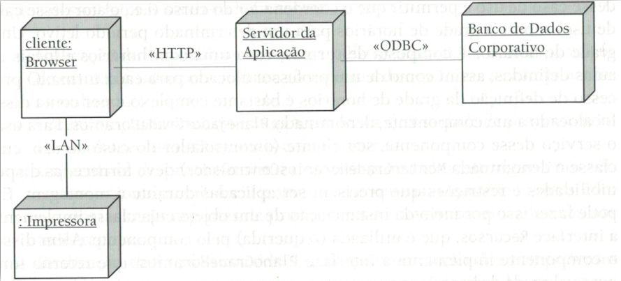

# LAB: Arquitura Física & Diagrama de Implantação

A **arquitetura física** refere-se à disposição dos subsistemas pelos nós de processamento disponíveis.  Utilizamos o **diagrama de implementação** para representar a arquitetura física de um sistema. Existem dois tipos de diagrama de implementação: o **diagrama de implantação** e o **diagrama de componentes**.

Neste laboratório prático vamos elaborar o diagrama de implantação do projeto integrado. Este diagrama mostra a topologia física do sistema, isto é, o mapeamento entre os componentes de software e o hardware utilizados.  Para elaborar o diagrama você pode utilizar a ferramenta [draw.io](https://draw.io)

## PASSO 1: Diagrama de Implantação - Nós

Os elementos de um diagrama de implantação são os nós e as conexões.

Um nó é uma unidade física que representa um recurso computacional, como processadores, dispositivos, sensores, roteadores, etc. Graficamente, um nó é representado por um cubo como na imagem abaixo. O nome e tipo do nó são definidos no interior do cubo. O nome e o tipo são separados por um sinal de dois pontos, sendo campos opcionais.

Converse com o seu time para identificar os nós que fazem parte do seu projeto.

## PASSO 2: Diagrama de Implantação - Conexões

Os nós são ligados por meio de conexões. Elas mostram os mecanismos de conexão entre os nós:

 meios físicos (cabos coaxial, fibra óptica) 
protocolos de comunicação (TCP/IP, HTTP, etc)

Uma conexão é representada por uma linha ligando os dois nós. A conexão pode ser estereotipada para indicar o tipo de comunicação, conforme mostrado na imagem a seguir. Neste exemplo, existem computadores pessoais se comunicando com o servidor através do  protocolo HTTP. O servidor se comunica com o sistema de gerência de banco de dados via OBDC.



Adicione as conexões correspondentes aos nós do seu projeto integrado.

## PASSO 3: Atualizando a Página Wiki do PI

Após elaborar os diagramas, crie uma nova seção na página wiki para adicioná-lo. Na página principal, adicione a seguinte estrutura em `Projeto Detalhado`:

```
* [[Diagrama de Implementação/Implantação da Solução Tecnológica]]
```

Em seguida, crie a página `Diagrama de Implementação/Implantação da Solução Tecnológica`, adicionando o diagrama criado nos passos anteriores.

## PASSO 4: Atualizando o Documento de Especificação do PI

Complete a seção correspondente no documento de especificação do PI, adicionando as imagens dos diagramas de sequência de projeto na seção Projeto Detalhado.

Após finalizar o roteiro, um membro da equipe deve **responder a issue** aberta neste projeto, adicionando um link para a página do diagrama de sequências do PI.

## Referências

Princípios de Análise e Projeto de Sistemas com UML. Eduardo Bezerra. 3 ed. Cap 11.2 - Arquitetura Física.