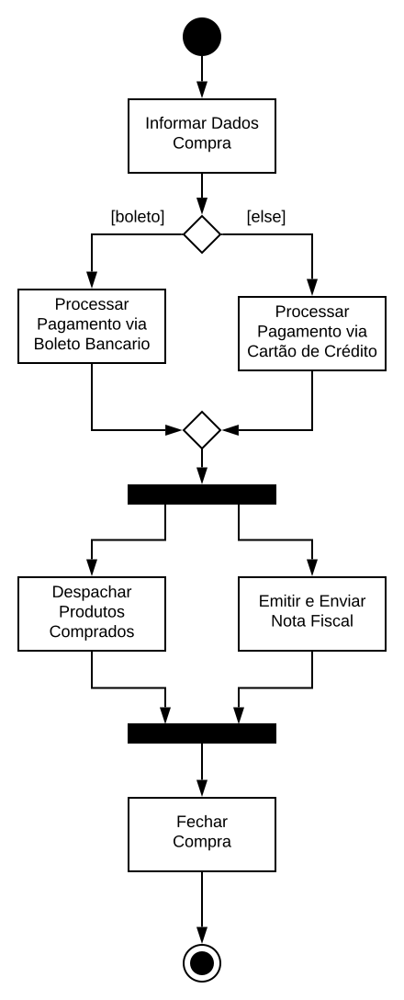

# LAB: Diagrama de Atividades

Utilizamos o [diagrama de atividades](https://engsoftmoderna.info/cap4.html#diagrama-de-atividades) para representar um processo ou fluxo de execução.

# PASSO 1: Elementos

Os elementos do diagrama podem ser divididos em dois grupos, que representam fluxos de controles sequenciais e fluxos de controles paralelos:

* Nodo Inicial
* Ações
* Decisões
* Merges
* Forks
* Joins
* Nodo Final

O exemplo a seguir mostra um diagrama de atividades do Livro de Engenharia de Software Moderna, que modela um processo de compra numa loja virtual.

Reproduza este diagrama utilizando a ferramenta [draw.io](https://draw.io). Em seguida, descreva o fluxo de execução, isto é, os possíveis caminhos percorridos pelo "token" do nodo inicial até o nodo final.

# PASSO 2: Partições

Os diagramas de atividades mostram o que está acontecendo, mas não mostra quem são os responsáveis. Isto não é necessariamente um problema, frequentemente o objetivo da modelagem é mostrar o que está ocorrendo.
Entretanto, se precisamos mostrar quem é responsável por cada parte do fluxo, podemos utilizar partições denominadas "raias" (isto é, __swimlanes__). Estas raias dividem o diagrama em compartimentos, sendo cada um deles referente à uma entidade.

O exemplo abaixo, mostra um diagrama de atividades dividido em raias extraído do Livro Princípios de Análise e Projeto de Sistemas com UML. Neste exemplo, estamos representando um fluxo de execução para acionar um seguro após um acidente com um automóvel.
Observe que existem três compartimentos: Segurado, Seguradora e Oficina. As atividades podem ser passadas entre as raias.
Além disso, as atividades podem ser executadas em paralelo.

Reproduza este diagrama utilizando a ferramenta [draw.io](https://draw.io). Em seguida, descreva o fluxo de execução, isto é, os possíveis caminhos percorridos pelo "token" do nodo inicial até o nodo final.

# PASSO 3: Entrega

Este roteiro deve ser realizado **individualmente**.

Deve-se submeter via SIGAA um relatório em formato PDF com os resultados do laboratório, incluindo as imagens dos diagramas e descrições dos fluxos.

**Obs.: Todas as entregas valem pontos.**

# Leitura:

## Quando utilizamos diagramas de atividades?

Os diagramas de atividades não são utilizados com frequência. Eles podem auxiliar, por exemplo:

* Quando precisamos **entender melhor um problema** e como os casos de uso do sistema se relacionam.

* Para modelar **regras de negócio complexas**;

* Quando precisamos **modelar a lógica dos casos de uso**. Nas descrições dos casos de uso, não existe uma sintaxe clara para documentar decisões, interações, e passos executados em paralelo. Portanto, podemos criar um diagrama de atividades para auxiliar no entendimento do caso de uso. Os fluxos são representados no mesmo diagrama (isto é, fluxo principal, alternativo, exceções).

## Diagramas auxiliares

Podemos decompor as ações do diagrama de atividades em **sub-atividades**. Por exemplo, no fluxo de compras numa loja virtual, poderíamos criar uma sub-atividades referente a ação "Despachar Produtos Comprados". Neste diagrama auxiliar, poderíamos detalhar o fluxo para entrega normal, entrega rápida, e retirada de produto na loja física.

# Referências

[1] Engenharia de Software Moderna. Marco Tulio Valente. Capítulo 4.6 - Diagrama de Atividades

[2] Princípios de Análise e Projeto de Sistemas com UML. Eduardo Bezerra. Capítulo 11 - Modelagem de Atividades

[3] UML Essencial: Um breve guia para a linguagem-padrão de modelagem de objetos. Martin Fowler. 3ª ed. Capítulo 11 - Diagrama de Atividades