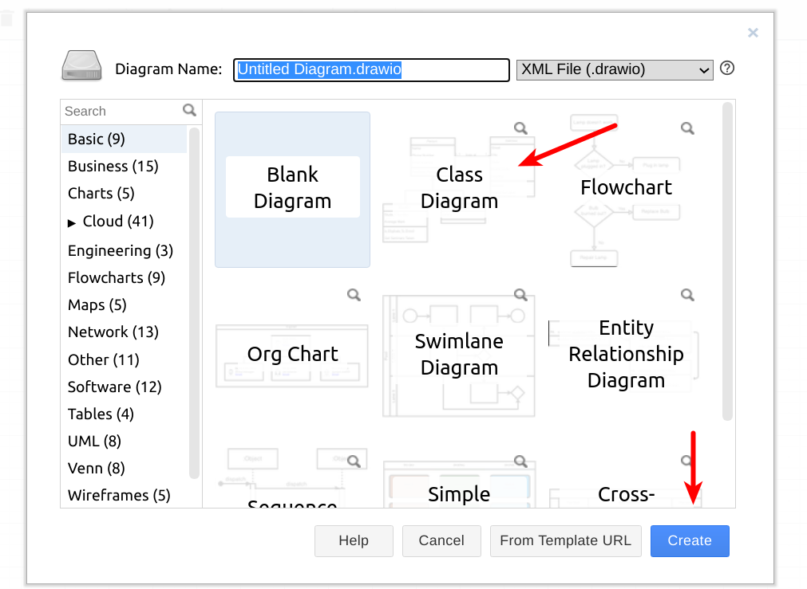

# LAB21: Diagrama de Classes

__[Diagramas de Classes](https://engsoftmoderna.info/cap4.html#diagramas-de-classes)__ são os diagramas mais usados da UML. Eles oferecem uma representação gráfica para um conjunto de classes, incluindo:

* informações sobre atributos e métodos;

* informações sobre os relacionamentos que existem entre as classes modeladas.

 

# Passo 1:

* No segundo bimestre cada grupo criou o diagrama de classes de domínio do projeto final. Na etapa de projeto, vamos adicionar novos detalhes.

*  Assita a playlist sobre diagramas de classes disponível no SIGAA.

# Passo 2:

* Utilizando os conceitos aprendidos, refine o diagrama de classes do seu projeto, adicionando informações como __multiplicidade__ e __visibilidade__ dos elementos.

* Lembre-se das recomendações para __agregação__ e __composição__!

* Se necessário, adicione novas classes e remova as classes que representam apenas conceitos.

* O seu diagrama não precisa de todos os relacionamentos estudados. Mas lembre-se, as classes do seu sistema não podem ser "ilhas sem comunicação" entre si.

* Após realizar as modificações, salve o diagrama num formato de imagem (por exemplo, .jpg, .png)

__Sugestão__: Para criar o diagrama, você pode utilizar ferramentas como [draw.io](https://draw.io). Nesta plataforma, existe um template para começar um diagrama de classes:

> 

 

>  
