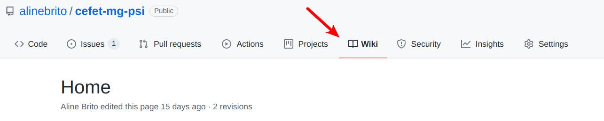
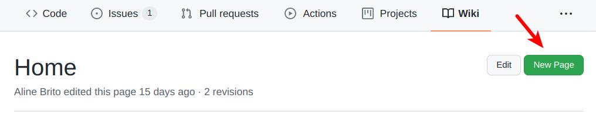
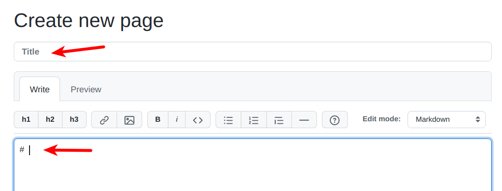
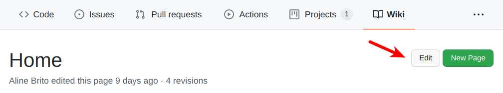

# LAB21: Wikis & Diagrama de Classes

Conforme aprendemos nas últimas aulas, podemos hospedar a documentação de um projeto em [wikis](https://docs.github.com/pt/communities/documenting-your-project-with-wikis/about-wikis).

Nesta aula, vamos adicionar o diagrama de classes no wiki do Projeto Integrado (PI).

</br>

# Passo 1:

Clone o wiki do PI. Para tanto, basta acionar ``.wiki`` ao final da URL:

> git clone git@github.com:owner/project.__wiki__.git

</br>


# Passo 2:

* No seu projeto local, adione uma pasta chamada ``imagens``. 

* Em seguida, adicione o diagrama de classes nesta pasta. __COMMIT & PUSH__

</br>

# Passo 3:

Na interface do GitHub, adicione uma nova página para o diagrama de classes:

</br>

* Acesse o wiki do projeto.

> 

</br>

* Pressione o botão `New Page` para criar uma nova página.

>   

</br>

* Em seguida, preencha os dados solicitados (título e descrição).

> 

</br>

* Adicione o diagrama de classes na página. Para referenciar a imagem ``diagrama_classes.png`` que está na pasta ``imagens``,
usamos ``[[imagens/diagrama_classes.png]]``. Podemos usar também ````. Dessa forma, podemos alterar o tamanho da imagem com o parâmetro ``width``.

</br>

* Adicione também uma breve descrição sobre as classes do diagrama.

</br>

* Na interface do GitHub, visualize a página na aba ``Preview``. Se estiver tudo certo, basta pressionar o botão `Save Page` para salvá-la. Pronto, a página do diagrama de classes foi criada!

# Passo 4:

Normalmente, a página principal dos wikis é um índice para as outras páginas do
projeto. Dessa forma, fica mais fácil localizar toda a documentação do sistema. 

Neste passo, vamos criar uma referência para o diagrama de classes.

</br>

* Retorne para a página principal do seu wiki (Home).

> 

</br>

* Pressione o botão ``Edit`` para habilitar o modo de edição.

> 

</br>

* Adicione uma nova seção chamada ``Documentação do Projeto``:

> ``## Documentação do Projeto``

</br>

* Nesta nova seção, adicione uma referência para a nova página. Para referenciarmos uma página chamada ``diagrama_classes``, usamos
``[[Diagrama de Classes|diagrama_classes]]``. O primeiro parâmetro refere-se ao nome que será exibido. O segundo parâmetro é o nome dado para a sua página
durante a criação.

</br>

* Na interface do GitHub, visualize a página na aba ``Preview``. Se estiver tudo certo, basta pressionar o botão `Save Page` para salvá-la. 

# Passo 5:

* Na issue indicada durante a aula, informe a página do diagrama de classes criada neste laboratório prático.