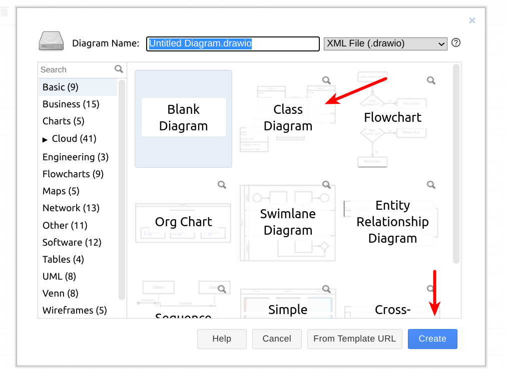
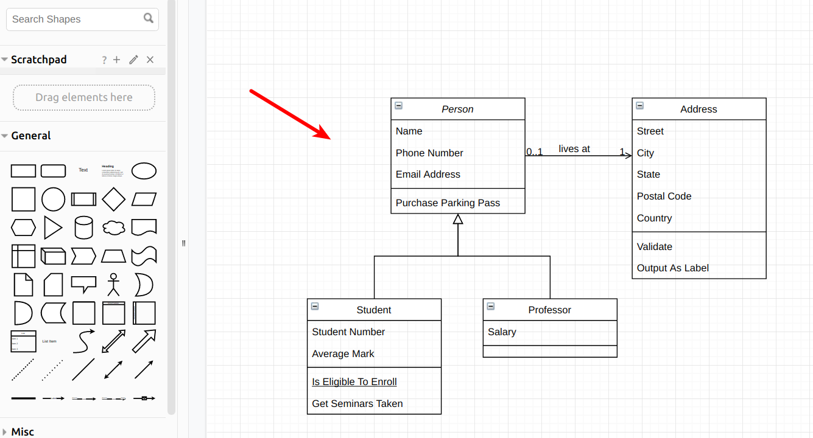
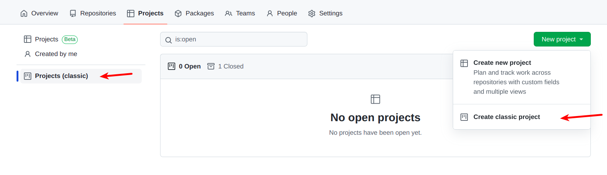
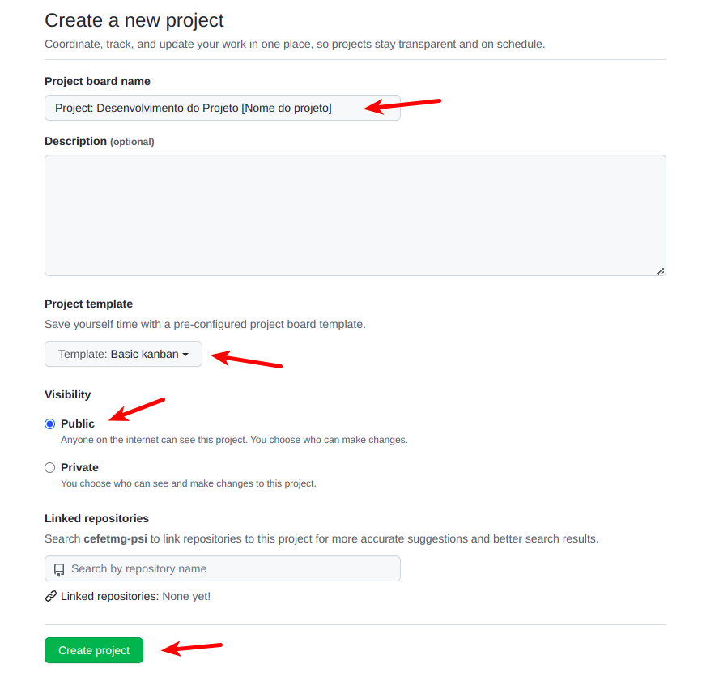
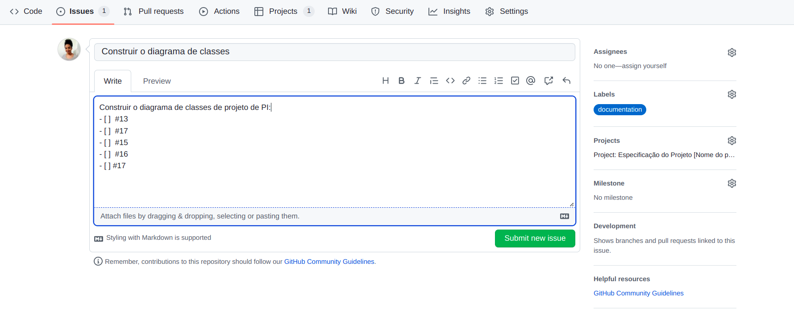
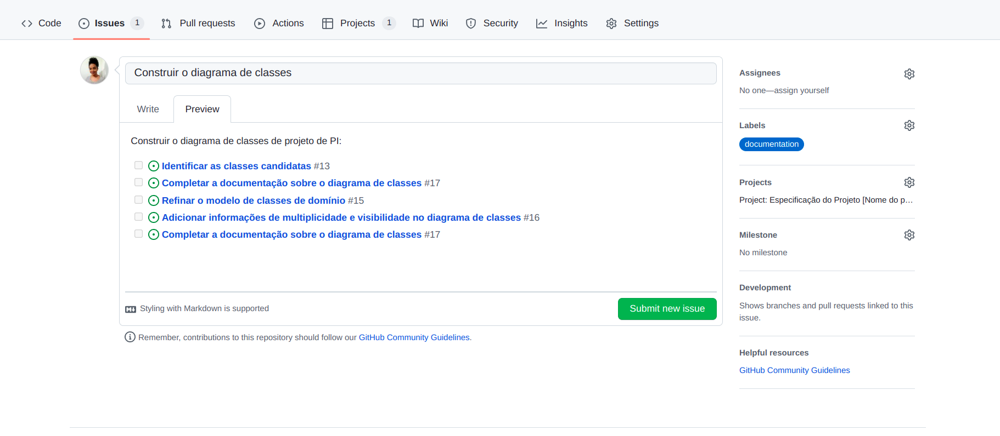
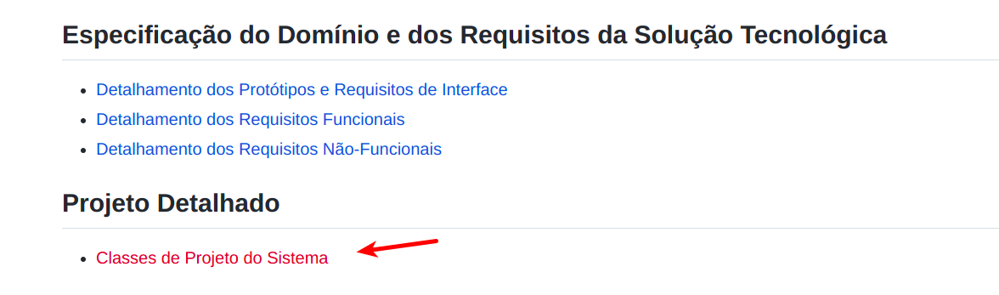

# LAB: Diagrama de Classes & Quadro Kanban

__[Diagramas de Classes](https://engsoftmoderna.info/cap4.html#diagramas-de-classes)__ são os diagramas mais usados da UML. Eles oferecem uma representação gráfica para um conjunto de classes, incluindo:

* informações sobre atributos e métodos;

* informações sobre os relacionamentos que existem entre as classes modeladas.

Neste laboratório prático vamos elaborar o diagrama de classes do PI.

__Sugestão__: Para criar o diagrama, você pode utilizar ferramentas como [draw.io](https://draw.io). Nesta plataforma, existe um template para começar um diagrama de classes:

> 

</br>

> 

Adicionalmente, vamos organizar as tarefas no quadro Kanban do GitHub.

## PASSO 1: Leitura - Conceitos básicos

O modelo de classes possui diferentes níveis de abstração:

* **Modelo de classes de domínio**: Neste modelo consideramos apenas informações que existem no domínio do negócio. Características de implementação devem ser abstraídas, como por exemplo, um atributo “idCliente”. O modelo de classes de domínio é construído na fase de análise. Neste modelo, não nos preocupamos com as tecnologias que serão utilizadas no sistema.

* **Modelo de classes de projeto (especificação)**: É uma extensão do modelo de classes de domínio, adicionando detalhes específicos conforme a solução de software escolhida. Neste modelo, definimos novas classes para desenvolver a solução do problema.


**Nomenclatura:**

* Identificadores: não utilizamos preposições ou espaços em branco.
* Nomes das classes e relacionamentos: o nomes começam com letra maiúscula, como por exemplo, "Cliente"e "Pedido".
* Nomes de atributos e operações: os nomes começam com letra minúscula e as palavras subsequentes utilizam letra maiúscula, como por exemplo, "quantidade", "dataNascimento", e "obterTotal".

## PASSO 2: Organizando as tarefas no GitHub

O GitHub permite criar [quadros](https://docs.github.com/pt/issues/organizing-your-work-with-project-boards/managing-project-boards/about-project-boards) para organizarmos as terefas.

Neste passo, vamos criar um quadro baseado no [Kanban](https://engsoftmoderna.info/cap2.html#kanban) para organizarmos as tarefas do PI.

Acesse o menu `Project` na organização do projeto.
Em seguida, selecione a opção "Projects (classic)" e pressione o botão `New Project` > `Create classic project`, conforme mostrado na figura a seguir.




Na tela exibida, informe o nome do quadro, selecione a opção `Basic Kanban`, selecione o template `Basic Kanban`, visibilidade `Public`, e pressione o botão `Create project`, conforme mostrado na figura abaixo. A interface do project será exibida.



Nós vamos utilizar o sistema de issues do GitHub para adicionar cartões no quadro. Portanto, acesse o menu `Issues` do projeto onde o grupo está construindo a página wiki.

Primeiro, vamos adicionar as tarefas necessárias para seguir este roteiro. Adicione uma nova issue através do botão `New issue` para cada uma das tarefas listas abaixo.

* Identificar as classes candidatas
* Completar a documentação sobre classes candidatas
* Refinar o modelo de classes de domínio
* Adicionar informações de multiplicidade e visibilidade no diagrama de classes
* Completar a documentação sobre o diagrama de classes

Os itens acima devem ser os títulos das issues. Você pode completar a descrição para que a tarefa fique clara.

Você pode adicionar também labels (isto é, `documentation`), e uma responsável pela issue na opção `Assignees`.

Agora, adicione uma issue geral que irá agrupar todas estas tarefas. O título da issue deve ser `Construir o diagrama de classes`. Na descrição, adicione o link as tarefas listadas acima, conforme mostrado nas imagens a seguir e no exemplo disponível em [https://github.com/alinebrito/cefet-mg-psi/issues/18](https://github.com/alinebrito/cefet-mg-psi/issues/18). Observe que o GitHub cria um link entre as issues.





Volte ao project criado anteriormente e adicione as mini tarefas necessárias para construir o diagrama de classes. Basta pressionar o botão `Add card` e arrastar as issues para a coluna `To do`.

Pronto! As tarefas para construir o diagrama de classes foram organizadas no quadro. Verifique se a estrutura do quadro está parecida com o [modelo](https://github.com/alinebrito/cefet-mg-psi/projects/1).

Para automatizar o processo, podemos configurar o quadro para mover a tarefa para `Done` se uma issue for encerrada. Para tanto, basta selecionar a opção `Manage automation` na coluna `Done` e marcar a opção `Closed - If an open issue in this project is closed, it will automatically move here`.

Os passos abaixo no roteiro mostram as instruções para executar este laboratório prático. Mova os cartões entre as colunas do quadro conforme as tarefas são executadas.

## PASSO 3: Identificando as classes candidatas, atributos, e responsabilidades

Para elaborar o modelo de classes, precisamos inicialmente identificar as classes candidatas. Em seguida, devemos eliminar as classes candidatas desnecessárias.

Existem várias propostas para identificar as classes candidatas:

* Análise gramatical de uma descrição em linguagem natural do sistema. Substantivos podem ser classes e atributos. Os verbos representam ações ou serviços providos pelos objetos.

* Utilizar entidades do domínio da aplicação (ex.: papéis, locais, unidades organizacionais, etc.)

* Uma análise baseada em cenários, onde analisamos diferentes cenários de uso, identificando objetos, atributos, e operações.

Na prática, nós precisamos utilizar diferentes fontes de conhecimento para descobrir as classes de objetos. Em seguida, podemos refinar e estender os objetos iniciais.

Neste passo, você precisa identificar as classes candidatas do modelo. Você pode utilizar, por exemplo, os casos de uso do PI, buscando por substantivos e verbos. Concentre-se nos objetos, sem se preocupar em como eles serão implementados.

Após identificar as classes de domínio, complete a Seção `Descrição das Classes de Domínio` correspondente na **página wiki** e no **documento de especificação**:

* Detalhamento dos Requisitos Não Funcionais
* Requisitos do Domínio
* Descrição das Classes de Domínio

Verifique o template da estrutura esperada para [página wiki](https://github.com/alinebrito/cefet-mg-psi/wiki/Detalhamento-dos-Requisitos-N%C3%A3o-Funcionais).

No documento de especificação, remove a seção `Diagrama de Classes de Domínio`, isto é, nós vamos apenas descrever as classes identificadas na tabela.


## PASSO 4: Refinando o modelo de classes

Após identificar os objetos, refine o modelo, por exemplo, observando características comuns e criando hierarquias. Se necessário, adicione novas classes e remova as classes que representam apenas conceitos. O seu diagrama não precisa de todos os relacionamentos estudados. Mas lembre-se, as classes do seu sistema não podem ser "ilhas sem comunicação" entre si.

## PASSO 5: Multiplicidade e Visibilidade

Ao final, complete o diagrama de classes, adicionando informações sobre __multiplicidade__ e __visibilidade__ dos elementos. Lembre-se das recomendações para __agregação__ e __composição__!


## PASSO 6: Atualizando a Página Wiki do PI


Após elaborar o diagrama de classes do projeto, crie uma nova seção na página wiki para adicioná-lo. Na página principal, adicione a seguinte estrutura:

```
## Projeto Detalhado

* [[Classes de Projeto do Sistema]]
```


Em seguida, crie a página `Classes de Projeto do Sistema`, adicionando o diagrama de classes criado nos passos anteriores.

Se você estiver utilizando a ferramenta draw.io, basta exportar uma imagem através da opção File > Export. Em seguida, faça upload dela na página wiki e adicione uma referência.

Você pode utilizar a sintaxe Markdown para adicionar a imagem. O Github também suporte a notação HML, conforme mostrado abaixo. Observe que neste exemplo estamos definindo também o tamanho da imagem, através do parâmetro "width".

``````

## PASSO 7: Atualizando o Documento de Especificação do PI

Complete a seção correspondente no documento de especificação do PI, adicionando a imagem do diagrama de classes de projeto na seção `Projeto Detalhado`.

## PASSO 8: Entrega

O laboratório prático deve ser realizado pelo grupo do PI. Entretanto, cada integrante do grupo deve submeter um relatório via SIGAA (1 página, formato PDF) com o nome completo, matrícula, nome do projeto, link para a página wiki, e link para o quadro de tarefas.

Os responsáveis por cada issue devem ser marcados na mesma, através da opção `Assignees`, conforme mostrado no roteiro acima.

Além disso, o relatório deve incluir uma breve descrição sobre como você participou deste laboratório prático, isto é, quais foram as suas principais contribuições.

**Obs.: Todas as entregas valem pontos.**

## Referências

Princípios de Análise e Projeto de Sistemas com UML. Eduardo Bezerra. Capítulo 5 - Modelagem de Classes do Domínio. Capítulo 6 - Passando da Análise ao Projeto.

Engenharia de Software Moderna. Marco Tulio Valente. Capítulo 4.3 - Diagrama de Classes.

UML Essencial. Martin Fowler. Capítulo 3 - Diagramas de Classes: Os Elementos Básicos.

Engenharia de Software. Ian Sommerville, 9ª ed. Capítulo 7.1.3 - Identificação dos objetos de classe