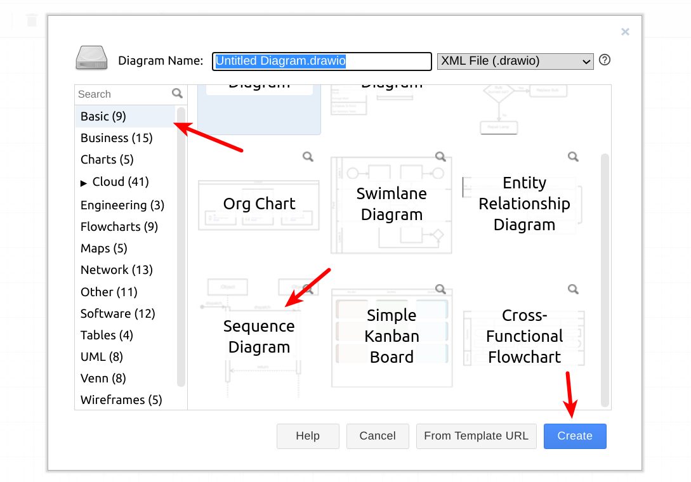
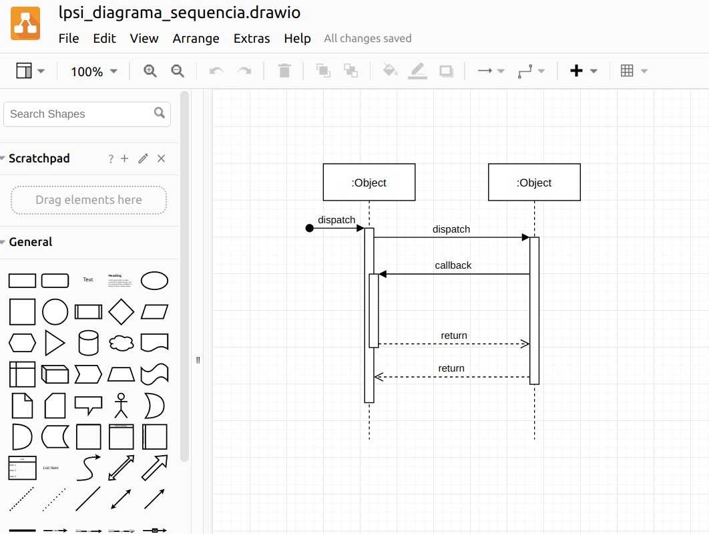

# LAB21: Diagrama de Sequência

Os __Diagramas de Interação__ descrevem como grupos de
objetos colaboram em algum comportamento. A UML define vários Diagramas de Interação. Dentre eles, o mais comum é o [__Diagrama de Sequência__](https://engsoftmoderna.info/cap4.html#diagramas-de-sequ%C3%AAncia). Este diagrama permite:

* modelar objetos do sistema;
* incluir informações sobre quais métodos desses objetos são executados em um determinado cenário.

 

# Passo 1:

Assita a playlist sobre diagramas de sequência disponível no SIGAA.

 

# Passo 2:

* Selecione um Caso de Uso __simples__ do Projeto Integrado (PI).
* Crie um diagrama de sequência para o caso de uso selecionado.
* Exporte o diagrama gerado para um formato de imagem (por exemplo, .jpg, .png)

__Sugestão__: Para criar o diagrama, você pode utilizar ferramentas como [draw.io](https://draw.io). Nesta plataforma, existe um template para começar um diagrama de sequência:

> 

 

> 

