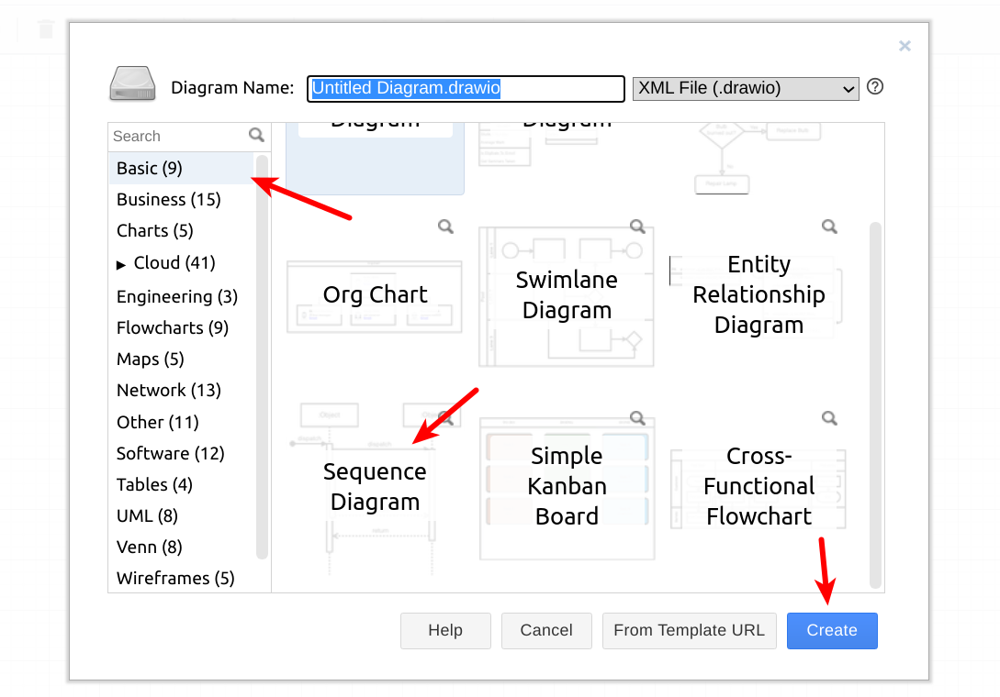
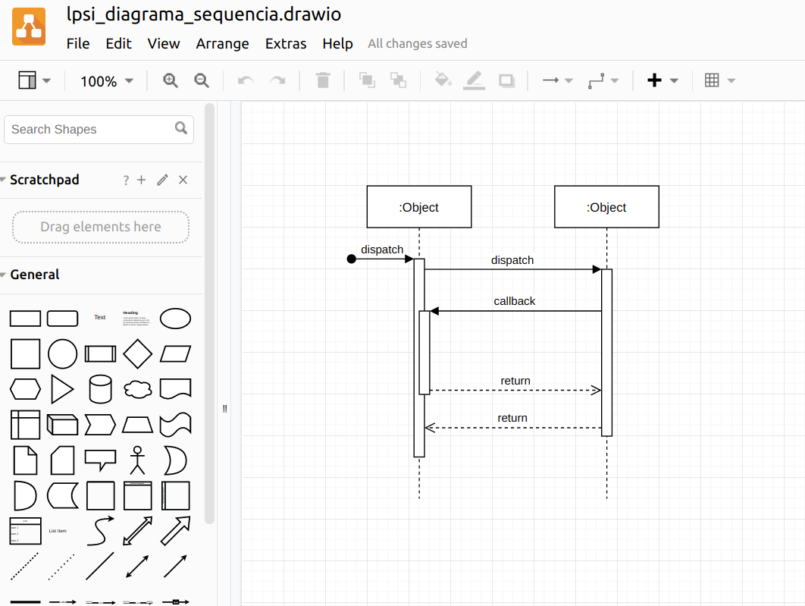
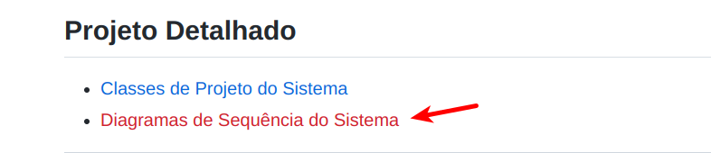

# LAB: Diagrama de Sequência

Os __Diagramas de Interação__ descrevem como grupos de
objetos colaboram em algum comportamento. A UML define vários Diagramas de Interação. Dentre eles, o mais comum é o [__Diagrama de Sequência__](https://engsoftmoderna.info/cap4.html#diagramas-de-sequ%C3%AAncia). Este diagrama permite:

* modelar objetos do sistema;
* incluir informações sobre quais métodos desses objetos são executados em um determinado cenário.


## PASSO 1: Criando Diagramas de Sequência

* Selecione os caso de uso que descrevem os cenários mais importantes do Projeto Integrado (PI). 
* Crie diagramas de sequência para os casos de uso selecionados. Se necessário, consulte o material disponível no SIGAA da aula teórica.
* Exporte os diagramas gerados para um formato de imagem (por exemplo, .jpg, .png)

__Sugestão__: Para criar o diagrama, você pode utilizar ferramentas como [draw.io](https://draw.io). Nesta plataforma, existe um template para começar um diagrama de sequência:

> 

</br>

> 

## PASSO 2: Atualizando a Página Wiki do PI

Após elaborar os diagramas de sequência do projeto, crie uma nova seção na página wiki para adicioná-los. Na página principal, adicione a seguinte estrutura:

```
## Projeto Detalhado

* [[Diagrama de Sequência do Sistema]]
```


Em seguida, crie a página `Diagrama de Sequência do Sistema`, adicionando os diagramas criados nos passos anteriores. Para cada caso de uso selecionado, adicione as seções mostradas abaixo. Você pode conferir o formato esperado no [template da página wiki](https://github.com/alinebrito/cefet-mg-psi/wiki/Diagramas-de-Sequ%C3%AAncia-do-Sistema).

```
## Diagrama de Sequência - [Nome do Caso de Uso]

### Fluxo Principal

[Adicionar imagem do diagrama]

### Extensões

[Adicionar imagem do diagrama]

```


Se você estiver utilizando a ferramenta draw.io, basta exportar uma imagem através da opção File > Export. Em seguida, faça upload dela na página wiki e adicione uma referência.

Você pode utilizar a sintaxe Markdown para adicionar a imagem. O Github também suporte a notação HML, conforme mostrado abaixo. Observe que neste exemplo estamos definindo também o tamanho da imagem, através do parâmetro "width".

``````

## PASSO 3: Atualizando o Documento de Especificação do PI

Complete a seção correspondente no documento de especificação do PI, adicionando as imagens dos diagramas de sequência de projeto na seção Projeto Detalhado.

## PASSO 4: Entrega

Após finalizar o roteiro, um membro da equipe deve **responder a issue** aberta neste projeto, adicionando um link para a página do diagrama de sequências do PI.

## Referências

Engenharia de Software Moderna. Marco Tulio Valente. Capítulo 4.5 - Diagrama de Sequência.

UML Essencial. Martin Fowler. Capítulo 5 - Diagramas de Interação.


