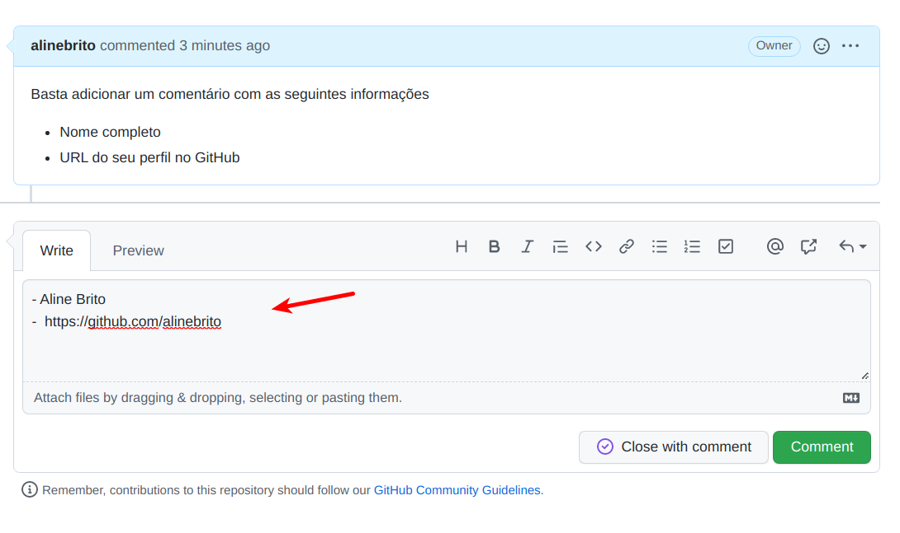
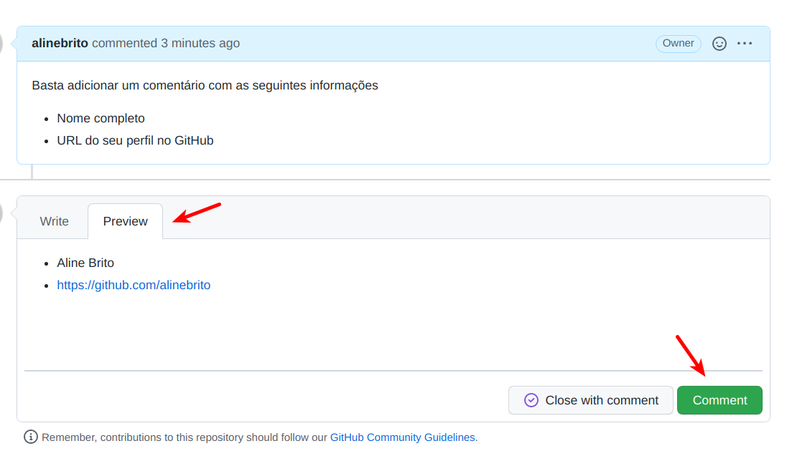

# LAB: Isses & Github

Nós vamos utilizar a plataforma GitHub no decorrer da disciplina. Dentre os recursos importantes, existem as [issues](https://docs.github.com/pt/issues/tracking-your-work-with-issues/about-issues). Podemos criar issues em um projeto no GitHub, por exemplo, para discutir ideias, gerenciar tarefas, e reportar defeitos.

Neste laboratório prático vamos começar a usar o sistema de issues no GitHub.

__Tarefa 1)__ Criar um perfil no [GitHub](https://github.com/).

__Tarefa 2)__ Responder a [issue](https://github.com/alinebrito/cefet-mg-psi/issues/5) deste repositório, informando o seu nome e o seu perfil no GitHub. A figura abaixo mostra um exemplo:

> 

 

Antes de submeter uma resposta, você pode observar o resultado através da aba `Preview`, conforme imagem a seguir. Se estiver tudo certo, basta pressionar o botão `Comment` para adicionar um comentário na issue.

> 

 

__Tarefa 3)__ A plataforma GitHub será utilizada também para desenvolvimento do Projeto Integrado (PI). Desta forma, é importante que todos os membros estejam familiarizados com o ambiente. O projeto poderá ser desenvolvido em grupos de 5 ou 6 pessoas. Após todos os membros do grupo realizarem este roteiro prático, um representante do grupo deve enviar um e-mail informando os nomes, e-mail, e matrícula dos integrantes do grupo. 

