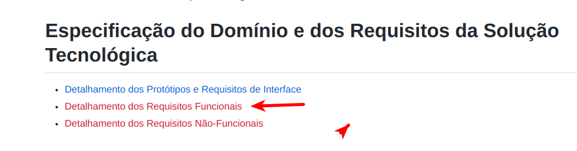

# LAB: Casos de Uso - Parte II

Consulte a [Seção 3.4](https://engsoftmoderna.info/cap3.html#casos-de-uso) do livro de Engenharia de Software Moderna sobre Casos de Uso e o material disponível no SIGAA da disciplina teórica.

# PASSO 1:

Verifique o template da estrutura esperada para página wiki disponível em [github.com/alinebrito/cefet-mg-psi/wiki](https://github.com/alinebrito/cefet-mg-psi/wiki)

Neste laboratório prático, vamos completar as seguintes seções:

* Detalhamento dos Requisitos Funcionais
    * Descrição em Alto Nível dos Casos de Uso
    * Detalhamento Essencial doS Casos de uso

# PASSO 2: Criando página para detalhar os requisitos funcionais

Na página wiki existe um item no menu em vermelho referente ao `Detalhamento dos Requisitos Funcionais`, conforme mostrado na imagem a seguir.

>
</br>


O link está em vermelho porque a página não existe. Portanto, adicione uma página para detalharmos os requisitos funcionais do PI. Para adicionar uma nova página wiki, na interface do GitHub, pressione a referência em vermelho na página. Você será direcionado para uma interface onde pode-se criar a página correspondente. Como alternativa, você pode adicionar a nova página através do botão New Page no menu lateral direito.

Os passos a seguir descrevem as seções que você precisa adicionar nesta nova página wiki.

# PASSO 3: Adicionando uma seção para mostrar o diagrama de casos de uso

Adicione uma seção chamada `Diagrama de Casos de Uso (Diagrama de Contexto)`. Esta seção será completada nas próximas aulas de laboratório.

# PASSO 4: Adicionando seção para descrever os casos de uso

Adicione uma seção chamada `Descrição em Alto Nível dos Casos de Uso`. Em seguida, complete a página, listando os casos de uso do projeto, que foram criados na semana anterior pelos membros do grupo. O objetivo é criar uma tabela conforme o template disponível em [template-secao-detalhamento-requisitos-funcionais](https://github.com/alinebrito/cefet-mg-psi/wiki/Detalhamento-dos-Requisitos-Funcionais#descri%C3%A7%C3%A3o-em-alto-n%C3%ADvel-dos-casos-de-uso).

Observe que estamos utilizando a sintaxe [Markdown para criar as tabelas](https://docs.github.com/pt/get-started/writing-on-github/working-with-advanced-formatting/organizing-information-with-tables).

# PASSO 5: Adicionando seção para detalhar os casos de uso

Adicione uma seção para cada caso de uso descrito anteriormente. Nesta seção, você deve detalhar os casos de uso, descrevendo as precondições, fluxo normal, e as extensões, se existirem. Observe que precisamos completar o título da seção, substituindo `<NOME DO CASO DE USO>` pelo nome dele. O objetivo é criar uma seção como o template disponível em [template-secao-detalhamento-requisitos-funcionais](https://github.com/alinebrito/cefet-mg-psi/wiki/Detalhamento-dos-Requisitos-Funcionais#detalhamento-essencial-do-caso-de-uso-nome-do-caso-de-uso).

Você pode utilizar o caracter "`>`" para destacar cada parte do caso de uso, conforme mostrado a seguir. 

```
> Precondições: 

> Fluxo normal:
> ...
> ...
> ...
> ...

> Extensões:
> ...
> ...
> ...
```

# PASSO 6: Adicionando os casos de uso no documento de especificação do PI

Complete estas mesmas seções da página wiki no documento de especificação do PI. Para as seções de detalhamento dos casos de uso, você pode substituir as tabelas (isto é, Precondições, Fluxo Principal, e Fluxo Alternativo) por texto.

# PASSO 7: Corrigindo e atualizando o documento de especificação do PI

Neste último passo, o grupo deve verificar se todas as sugestões refentes à primeira entrega do PI foram aplicadas na página wiki e no documento de especificação, isto é, as entregas do primeiro bimestre devem ser revisadas.

**Páginas wiki e documentos incompletos, sem as sugestões aplicadas ou desatualizados não serão aceitos.**

# PASSO 8: Entrega

O laboratório prático deve ser realizado pelo grupo do PI. Entretanto, **cada integrante** do grupo deve submeter um **relatório via SIGAA** (1 página, formato PDF) com o nome completo, matrícula, nome do projeto, e link para a página wiki. Além disso, o relatório deve incluir uma breve descrição sobre como você participou deste laboratório prático, isto é, quais foram as suas principais contribuições.

O **documento de especificação** do PI deve ser entregue via **SIGAA da disciplina teórica**, em formato PDF, uma submissão por grupo. O documento deve incluir as sugestões enviadas por e-mail, referentes as entregas do primeiro bimestre, e as seções desenvolvidas neste laboratório prático, que referem-se aos casos de uso.

**Obs.: Todas as entregas valem pontos.**