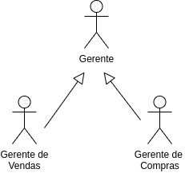

# LAB: Diagramas de Casos de Uso

A UML define o __[Diagrama de Casos de Uso](https://engsoftmoderna.info/cap3.html#diagramas-de-casos-de-uso)__, que consiste em um sumário gráfico para os casos de uso do sistema. Este diagrama mostra os **atores**, os **casos de uso**, e os **relacionamentos** entre eles.

## PASSO 1: Template

Verifique o template da estrutura esperada para página wiki disponível em [github.com/alinebrito/cefet-mg-psi/wiki](https://github.com/alinebrito/cefet-mg-psi/wiki)

Neste laboratório prático, vamos completar a seguinte seção:

* Detalhamento dos Requisitos Funcionais
    * Diagrama de Casos de Uso (Diagrama de Contexto)

## PASSO 2: Ferramentas CASE

Escolha uma ferramenta CASE de sua preferência para executar este roteiro.

__Sugestão__: Você pode utilizar a ferramenta [draw.io](https://draw.io).

Basta acessar a opção `Create new diagram`, pressionar o botão `create`, selecionar uma pasta para salvar o projeto, e atribuir um nome para o mesmo.

Ao final do laboratório, basta exportar o projeto através das opções `File` > `Export`. Dessa forma, você pode importá-lo em outro momento.

## PASSO 3: Atores

Os papéis dos usuários são modelados através de atores (pequenos bonecos).

Se existem muitos atores do sistema, você pode agrupá-los em atores genéricos, que compartilham características comuns. Estes atores são conectados por meio de herança. No exemplo abaixo, o "Gerente de Compras" e o "Gerente de Vendas" tem aspectos em comum, sendo agrupados no ator "Gerente".



Neste passo, você deve verificar e organizar os atores do PI. Em seguida, adicione estes atores no diagrama.

## PASSO 4: Casos de Uso

Representamos os casos de uso do sistema como elipses no diagrama. Neste passo, você deve adicionar as **elipses** referentes aos casos de uso criados nas aulas anteriores.

## PASSO 5: Relacionamentos

As notações UML podem variar conforme os autores. Nas nossas aulas, vamos seguir as notações definidas pelo livro [UML Essencial](https://www.amazon.com.br/UML-Essencial-Linguagem-Padrao-Modelagem-Objetos-ebook/dp/B019IQOFRK) e pelo livro de [Engenharia de Software Moderna](https://engsoftmoderna.info/).

Normalmente, utilizamos uma **ligação sem direção** para representar a **comunicação entre atores e casos de uso**. Entretanto, a UML também define outros tipos de relacionamentos:

* `<<include>>`: quando queremos deixar explícito que um caso de uso **inclui** outro. O livro de Engenharia de Software Moderna mostra um [exemplo](https://engsoftmoderna.info/cap3.html#diagramas-de-casos-de-uso), em que "Transferir valores" inclui o caso de uso "Autenticar clientes".

* `<<extend>>`: Dizemos que um caso de uso A estende um caso de uso B, quando a execução de B é opcional. Em outras palavras, se A é executado, B **poderá** será executado também (talvez não seja). Entretanto, estas derivações de relacionamentos podem demandar tempo, trazendo poucos benefícios para o projeto. Conforme mencionado por Fowler, devemos nos concentrar "na descrição
textual de um caso de uso; é aí que reside o valor real da técnica". Portanto, **não vamos utilizar o relacionamento "extend"** nos nossos diagramas.

Neste passo, você deve adicionar os relacionamentos do diagrama. Lembre-se de adicionar um **retângulo** para delimitar o espaço do sistema.


## PASSO 6: Página wiki


Complete a seção `Diagrama de Casos de Uso (Diagrama de Contexto)` na página wiki, adicionando a imagem do diagrama criado nos passos anteriores.

Se você estiver utilizando a ferramenta draw.io, basta exportar uma imagem através da opção `File` > `Export`.
Em seguida, faça upload dela na página wiki e adicione uma referência.

Você pode utilizar a sintaxe [Markdown](https://docs.github.com/pt/get-started/writing-on-github/getting-started-with-writing-and-formatting-on-github/basic-writing-and-formatting-syntax#images) para adicionar a imagem. O Github também suporte a notação HML, conforme mostrado abaixo. Observe que neste exemplo estamos definindo também o tamanho da imagem, através do parâmetro "width".

````

## PASSO 7: Documento de especificação do PI

Complete a seção correspondente no documento de especificação do PI, adicionando a imagem do diagrama de casos de uso.

## PASSO 8: Entrega

O laboratório prático deve ser realizado pelo grupo do PI. Entretanto, **cada integrante** do grupo deve submeter um **relatório via SIGAA** (1 página, formato PDF) com o nome completo, matrícula, nome do projeto, e link para a página wiki. Além disso, o relatório deve incluir uma breve descrição sobre como você participou deste laboratório prático, isto é, quais foram as suas principais contribuições.

**Obs.: Todas as entregas valem pontos.**


## Referências

Engenharia de Software Moderna. Marco Tulio Valente. Capítulo 3.4.1 - Diagramas de Casos de Uso.

UML Essencial: Um breve guia para a linguagem-padrão de modelagem de objetos. Martin Fowler. 3ª ed. Capítulo 9 - Casos de Uso.

Wilson de Pádua Paula Filho. Engenharia de Software: fundamentos, métodos e padrões; Capítulo 2.2.3 - Definição dos requisitos.