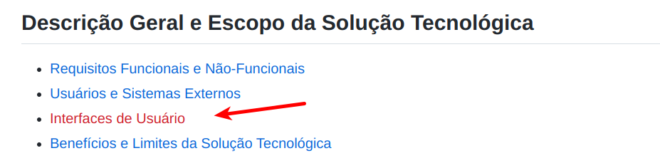
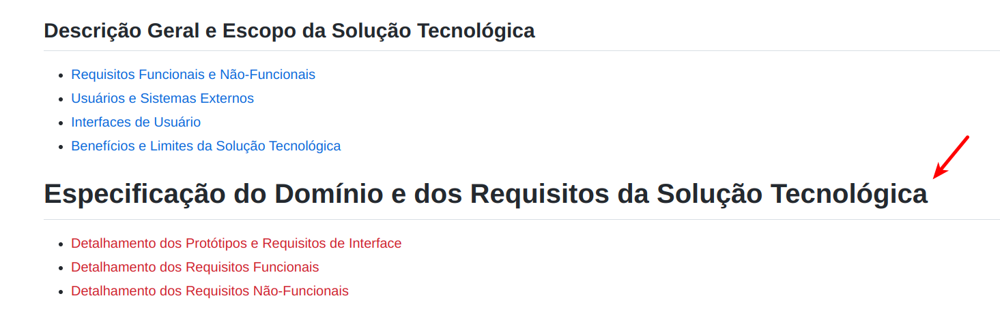

# LAB: Requisitos de Interface

Neste laboratório prático, vamos continuar a  especificação do Projeto Integrado (PI). Consequentemente, esta atividade deve ser realizada pela equipe do projeto.

# Passo 1:

Verifique o template da estrutura esperada para página wiki disponível em [github.com/alinebrito/cefet-mg-psi/wiki](https://github.com/alinebrito/cefet-mg-psi/wiki)

Neste laboratório, nós vamos completar as seguintes seções:

* Interfaces de Usuário (Lista de Interfaces)

* Detalhamento dos Protótipos e Requisitos de Interface

# Passo 2: Criando a página para listar as interfaces de usuário

Na página wiki existe um item no menu em vermelho referente às `Interfaces de Usuário`, conforme mostrado na imagem a seguir. 

>
</br>

O link está em vermelho porque a página não existe. Portanto, adicione uma página para listar as interfaces de usuário do PI. Para adicionar uma nova página wiki, na interface do GitHub, pressione a referência em vermelho na página. Você será direcionado para uma interface onde pode-se criar a página correspondente. Como alternativa, você pode adicionar a nova página através do botão `New Page` no menu lateral direito. 

Complete a página, listando as interfaces de usuário do projeto. O objetivo é criar uma página como o template disponível em [template-secao-requisitos](https://github.com/alinebrito/cefet-mg-psi/wiki/Interfaces-de-Usu%C3%A1rio). 

Observe que vamos utilizar a sintaxe [Markdown para criar as tabelas](https://docs.github.com/pt/get-started/writing-on-github/working-with-advanced-formatting/organizing-information-with-tables).

# Passo 2: Adicionando seção para detalhar os requisitos

Inicialmente, vamos adicionar uma nova seção na página principal, conforme mostrado na figura abaixo.

>
</br>

Para tanto, pressione o botão `Edit` na página wiki e adicione as seções correspondentes. 

```
# Especificação do Domínio e dos Requisitos da Solução Tecnológica

* [[Detalhamento dos Protótipos e Requisitos de Interface]]
* [[Detalhamento dos Requisitos Funcionais]]
* [[Detalhamento dos Requisitos Não-Funcionais]]
```

Verifique se a sua página está igual ao template fornecido através da aba `Preview`. Se estiver tudo certo, basta salvar.

# Passo 3: Criando página para detalhar os requisitos de interface

Uma interface compreende as partes do sistema que o usuário mantém contato durante a interação. Neste contexto, o documento de especificação de requisitos pode incluir também uma seção que descreve os requisitos de interface do sistema. Dessa forma, o cliente pode definir restrições específicas relacionadas às interfaces: cor, estilo, interação, comandos, etc. Normalmente, adicionamos também um esboço das interfaces.

Neste passo, vamos criar uma seção para detalhar as principais interfaces do PI. Portanto, adicione uma página para a subseção `Detalhamento dos Protótipos e Requisitos de Interface`.


A nova página deve seguir o template disponível em [template-prototipos-e-requisitos-interface](https://github.com/alinebrito/cefet-mg-psi/wiki/Detalhamento-dos-Prot%C3%B3tipos-e-Requisitos-de-Interface). Adicione as subseções correspondentes para cada interface listada no **Passo 1**, isto é, `Leiaute`, `Campos`, e `Comandos`.

Você não precisa preencher as informações neste passo, basta criar o layout da página wiki.  Verifique se a sua página está igual ao template fornecido através da aba `Preview`. Se estiver tudo certo, basta salvar.

# Passo 4: Detalhando requisitos de interface

Na nossa última aula, cada grupo elaborou esboços das interfaces em papel. Utilizando estes esboços, discuta com a sua equipe quais são os campos e comandos relevantes destas interfaces. Em seguida, complete as respectivas seções na página wiki, isto é, as subseções `Campos` e  `Comandos` de cada interface do sistema.

Por exemplo, supondo que estamos especificando a interface de um sistema para reservar  projetores no Cefet-MG. Na tela de solicitação, existe o `campo Nome`, onde o solicitante deve informar o seu nome completo. Neste contexto, podemos ter os seguintes detalhes referentes à este campo na especificação:

* Nome do campo: Nome
* Descrição: Nome completo do solicitante
* Valores válidos: Caracteres alfanuméricos
* Tipo: Texto
* Restrições: Campo de preenchimento obrigatório, máximo 40 caracteres

Supondo ainda que o usuário que está reservando um projetor decidiu interroper o procedimento. É importante permitirmos que os usuários cancelem ou desfaçam uma ação. Portanto, o `comando Cancelar` é importante neste contexto. Podemos detalhá-lo da seguinte forma:

* Nome: Cancelar
* Ação: Cancela a solicitação de um projetor e limpa os campos preenchidos na interface 
* Restrições: Não se aplica

Para o `comando Salvar` poderíamos detalhar restrições sobre os dados informados durante o cadatro. Por exeplo, *"campos obrigatórios preenchidos corretamente"*.

**Observação:** Neste momento, não precisamos completar a seção `Leiaute sugerido`. Nas próximas aulas, vamos utilizar ferramentas de prototipação para criar os esboços das interfaces.

# Passo 5: Entrega

O laboratório prático deve ser realizado pelo grupo do PI. Entretanto, **cada integrante** do grupo deve submeter um relatório via SIGAA (**1 página, formato PDF**) com o nome completo, matrícula, nome do projeto, e link para a página wiki. 

Além disso, o relatório deve incluir uma breve descrição sobre como você participou deste laboratório prático, isto é, quais foram as suas principais contribuições.


