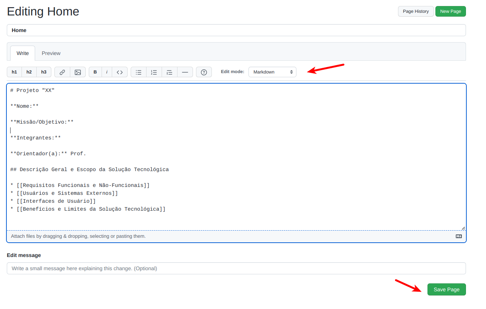
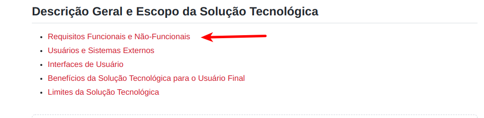
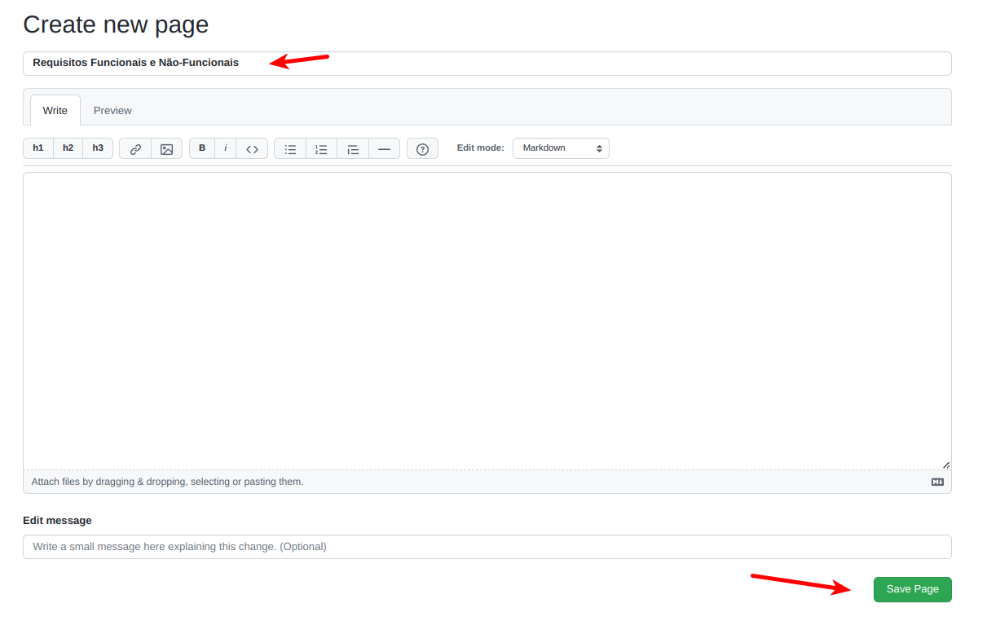

# LAB: Requisitos de Software

Neste laboratório prático, vamos iniciar a  especificação do Projeto Integrado (PI). Consequentemente, esta atividade deve ser realizada pela equipe do projeto.


# Passo 1:

Verifique o template da estrutura esperada para  a wiki disponível em [github.com/alinebrito/cefet-mg-psi/wiki](https://github.com/alinebrito/cefet-mg-psi/wiki)

Neste laboratório, nós vamos completar as seguintes seções:

* Nome, missão/objetivo, integrantes, e orientador(a).

* Requisitos Funcionais e Não-Funcionais

* Usuários e Sistemas Externos

* Benefícios e Limites da Solução Tecnológica


# Passo 2: Criando a página principal

Acesse a página wiki do seu projeto e pressione o botão `Edit`. Você pode fazer as alterações localmente também. Basta adicionar `.wiki` ao final da url para clonar as páginas. Por exemplo: `git clone git@github.com:alinebrito/cefet-mg-psi.wiki.git`

Na página principal (isto é, Home), adicione a seguinte estrutura:

```
# Projeto "XX"

**Nome:**

**Missão/Objetivo:**

**Integrantes:**

**Orientador(a):** Prof. 

## Descrição Geral e Escopo da Solução Tecnológica

* [[Requisitos Funcionais e Não-Funcionais]]
* [[Usuários e Sistemas Externos]]
* [[Interfaces de Usuário]]
* [[Benefícios e Limites da Solução Tecnológica]]
```
Observe que estamos usando a linguagem de marcação Markdown. Utilizamos asteriscos para lista de itens e colchetes para referenciar novas páginas. Na interface GitHub, existe uma barra de ferramentas com opções para edição, conforme mostrado na imagem abaixo.

> 

</br>

Após adicionar as seções, pressione o botão `Save Page`. Caso você esteja editando os arquivos localmente, basta submetê-los para o repositório utilizando os comandos *git*, como no exemplo abaixo.

> git add Home.md\
> git commit -m "wiki: Adicionando página principal"\
> git push origin main


# Passo 3: Detalhando o projeto

Neste segundo passo, vamos completar as informações básicas do projeto.

Complete a página principal, adicionando o nome do projeto, integrantes da equipe, e orientador(a). Além disso, adicione uma breve descrição sobre qual é o objetivo geral do projeto que está sendo construído.

Ao final, **salve as modificações**.

# Passo 4: Criando a página dos Requisitos Funcionais e Não-Funcionais

Conforme aprenderemos nas últimas aulas, **requisitos funcionais** estão relacionados com o que um sistema deve fazer, isto é, as suas funcionalidades. Já os **requisitos não-funcionais** estão relacionados com as restrições do sistema.

Neste passo, vamos listar os requisitos funcionais e não-funcionais do PI. 

Conforme mostrado anteriormente, utilizamos colchetes para referenciar páginas, por exemplo `[[Requisitos Funcionais e Não-Funcionais]]`. Os links para as páginas são exibidos em vermelho na plataforma GitHub, se a página não existe.
Observe que na página principal da wiki, existe uma seção em vermelho chamada `Requisitos Funcionais e Não-Funcionais`. Portanto, precisamos criá-la!


</br>

Para adicionar uma nova página na wiki, na interface do GitHub, pressione a referência em vermelho na página. Você será direcionado para uma interface onde pode-se criar a página correspondente, conforme mostrado na imagem abaixo. Como alternativa, você pode adicionar a nova página através do botão `New Page` no menu lateral direito. 


</br>


Complete a página. O objetivo é criar uma página como o template disponível em [template-secao-requisitos](https://github.com/alinebrito/cefet-mg-psi/wiki/Requisitos-Funcionais-e-N%C3%A3o-Funcionais). Observe que vamos utilizar a sintaxe [Markdown para criar as tabelas](https://docs.github.com/pt/get-started/writing-on-github/working-with-advanced-formatting/organizing-information-with-tables):

```

# Requisitos Funcionais

|#| Código -  Nome do Requisito | Descrição do Requisito|
|:-:|:-|:-|
| 1 | RF01 - Nome  |   |
| 2 | RF02 - Nome  |   |
| 3 | RF03 - Nome  |   |
| 4 | RF04 - Nome  |   |
| 5 | RF05 - Nome  |   |
| 6 | ...  | ...  |

# Requisitos Não-Funcionais

|#| Código -  Nome do Requisito | Descrição do Requisito|
|:-:|:-|:-|
| 1 | RNF01 - Nome  |   |
| 2 | RNF02 - Nome  |   |
| 3 | RNF03 - Nome  |   |
| 4 | RNF04 - Nome  |   |
| 5 | RNF05 - Nome  |   |
| 6 | ...  | ...  |

```

Verifique se a sua página está igual ao template fornecido através da aba `Preview`. Se estiver tudo certo, basta salvar.

# Passo 5: Criando a página dos usuários e sistemas externos

Repita os passos descritos anteriormente para criar a página referente à seção `Usuários e Sistemas Externos`. A nova página deve ser igual ao template disponível em [template-secao-usuarios-e-sistemas-externos](https://github.com/alinebrito/cefet-mg-psi/wiki/Usu%C3%A1rios-e-Sistemas-Externos).


# Passo 6: Criando a página para descrever os benefícios e limites do projeto

Repita os passos descritos anteriormente para criar a página referente à seção `Usuários e Sistemas Externos`. A nova página deve ser igual ao template disponível em [template-secao-beneficios-e-limites](https://github.com/alinebrito/cefet-mg-psi/wiki/Benef%C3%ADcios-e-Limites-da-Solu%C3%A7%C3%A3o-Tecnol%C3%B3gica).


# Passo 7: Completar as páginas

Por fim, neste último passo, o grupo deve se reunir para discutir e completar as seções criadas anteriormente:

* Requisitos Funcionais e Não-Funcionais
* Usuários e Sistemas Externos
* Benefícios e Limites da Solução Tecnológica

**Observações e sugestões:**  A seção referente às interfaces será completada na próxima aula. Portanto, o link  permanece em vermelho na página principal. Concentre-se nas principais funcionalidades do projeto. Além disso, considere o escopo da solução proposta, visto que, o mesmo deverá ser implementado até o **final do terceiro bimestre**.

