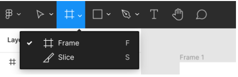
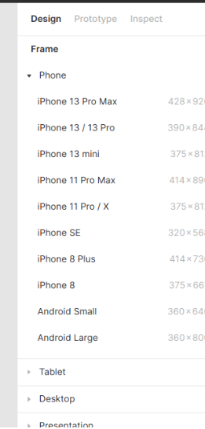
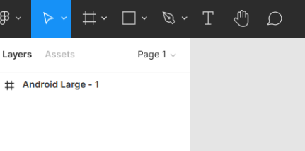
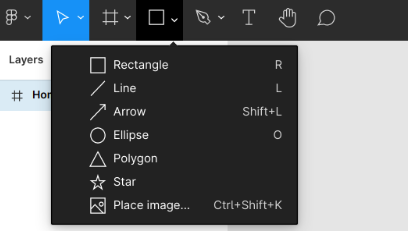
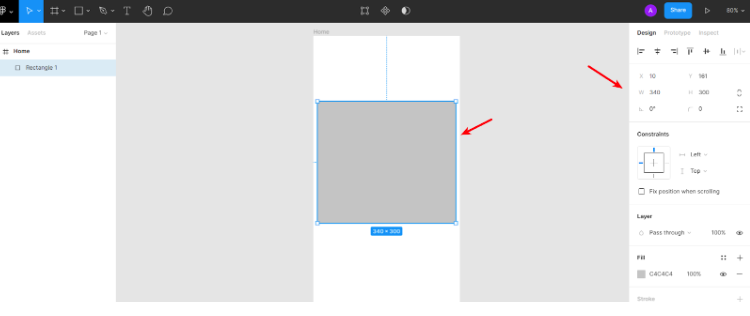
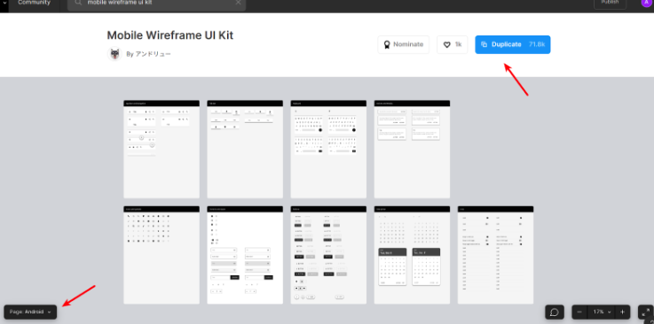

# Requisitos de Interface & Protótipos

Neste laboratório prático, vamos aprender a utilizar a ferramenta Figma, frequentemente utilizada para construção de protótipos de interfaces.

O objetivo é entender o funcionamento básico da ferramenta para completar a seção `Detalhamento dos Protótipos e Requisitos de Interface` do documento de especificação do PI.

# Passo 1: Criando conta na ferramenta Figma

Verifique o template da estrutura esperada para página wiki disponível em [github.com/alinebrito/cefet-mg-psi/wiki](https://github.com/alinebrito/cefet-mg-psi/wiki)

Em seguida, crie uma conta na ferramenta [Figma](https://www.figma.com). 

# Passo 2: Criando protótipos das interfaces do PI

Representações das interfaces---também chamadas de protótipos---podem ser classificadas conforme o grau de fidelidade. Nas últimas aulas nós elaboramos **representações de baixa fidelidade** das principais interfaces do PI, isto é, esboços sem preocupação com detalhes. Neste laboratório, nós vamos **criar representações de alta fidelidade**, baseando-se nas especificações detalhadas nas aulas anteriores. Representações de alta fidelidade consideram o desenho completo da interface. Em outras palavras, nesta etapa incluímos detalhes como tamanho dos elementos, cores, e fontes.

Portanto, neste passo o grupo deve se reunir para conversar sobre os detalhes que serão considerados em cada interface. Em seguida, elabore os protótipos de alta fidelidade das interfaces do PI utilizando a ferramenta Figma. Verifique as instruções e sugestões descritas no final deste roteiro para utilizar a ferramenta.

# Passo 3: Adicionando os protótipos de interfaces na página wiki

Após criar os protótipos de alta fidelidade das interfaces do PI, você deve completar a seção correspondente na página wiki.

Primeiro, faça upload das imagens via `git` ou através da interface da plataforma GitHub.

Em seguida, complete os espaços reservados do template, adicionando a interface correspondente, isto é, as seções `Leiaute sugerido` de cada interface. 
Verifique as [instruções sobre como adicionar imagens](https://docs.github.com/pt/get-started/writing-on-github/getting-started-with-writing-and-formatting-on-github/basic-writing-and-formatting-syntax#images) na documentação oficial.

# Passo 4: Entrega

O laboratório prático deve ser realizado pelo grupo do PI. Entretanto, **cada integrante** do grupo deve submeter um relatório via SIGAA (**1 página, formato PDF**) com o nome completo, matrícula, nome do projeto, e link para a página wiki. 

Além disso, o relatório deve incluir uma breve descrição sobre como você participou deste laboratório prático, isto é, quais foram as suas principais contribuições.

# Figma: Instruções e Sugestões

Após efetuar o login, basta adicionar um novo arquivo através do botão `New design file`. Em seguida, adicione um frame através da barra de ferramentas, conforme mostrado na figura a seguir.

>
 

Após pressioná-lo, um menu é exibido no lado direito, onde podemos definir a dimensão do frame. Por exemplo, se o seu projeto refere-se a um aplicativo mobile, você pode selecionar a opção "Android Large", conforme exemplo abaixo.

>
 

Após selecionar a dimensão, o frame é exibido no menu esquerdo conforme imagem a seguir. Você pode renomeá-lo pressionando com o botão direito do mouse e selecionando a opção “Rename”.

>
 

* **Camadas**: Para desenhar elementos básicos, como por exemplo, círculos e retângulos, podemos utilizar a barra de ferramentas.  Basta selecionar a opção desejada e em seguida desenhá-la na área do frame, conforme mostra nas figuras a seguir. Assim como os frames, podemos ajustar as configurações das camadas através do menu lateral direito.

>
 

>
 

* **Grupos de camadas:**  Podemos também criar grupos de camadas. Grupos permitem manipular os objetos em conjuntos, como por exemplo, movê-los facilmente, sem a necessidade de selecionar cada elemento. Para agrupar as camadas, basta selecioná-las e utilizar o comando `ctrl + G`. Os grupos criados são exibidos no menu lateral direito, conforme mostrado na imagem abaixo. Grupos são parecidos  com frames quando observamos no menu. Porém, grupos referem-se a um conjunto de camadas. Logo, não podemos adicionar propriedades. Eles são utilizados para organizar as camadas ou para ajustar as propriedades de todas as camadas relacionadas. Frames possuem dimensões e propriedades.

* **Componentes e bibliotecas:** A plataforma Figma também oferece componentes e bibliotecas que podem ser reutilizados. Componentes incluem elementos básicos, como ícones, botões, e menus. Já as bibliotecas incluem coleções de componentes e estilos. Nós podemos usar bibliotecas para criar, compartilhar, ou utilizar componentes entre os arquivos no Figma. Você pode consultar a [comunidade Figma](https://www.figma.com/community) para realizar os arquivos compartilhados pelos usuários. Por exemplo, podemos utilizar [Mobile Wireframe UI Kit](https://www.figma.com/community/file/900479694578549256) em protótipos de sistemas mobile. Para reutilizá-lo, basta pressionar o botão "Duplicate". Em seguida, você deve mover o arquivo para o seu projeto através da opção "Move to Project", conforme mostrado nas figuras a seguir.
Para as contas "Professional", você pode publicar o componente. Dessa forma, ele pode ser importado por todos os membros do time. Para as demais contas, você pode copiar os elementos desejados e em seguida colar no seu arquivo. A manutenção dos componentes é mais fácil, visto que, uma alteração no componente original implica na atualização das instâncias utilizadas no projeto.

>
 

* **Interação e Feedback**: A ferramenta Figma permite a contribuição e interação de outros membros do projeto. Podemos, por exemplo,  compartilhar o link do projeto com outros usuários que não fazem parte do time através do botão "Share". Existe uma opção para adicionar comentários na barra de ferramentas. Teste estas funcionalidades com os membros do seu grupo do PI. Por exemplo, você pode utilizá-las para avaliar as interfaces e para construir os protótipos em equipe.

* **Outros recursos:** A ferramenta Figma oferece outros recursos úteis, como por exemplo, criação de protótipos navegáveis e constraints. O roteiro [Figma For Beginners](https://www.youtube.com/watch?v=Cx2dkpBxst8&list=PLXDU_eVOJTx7QHLShNqIXL1Cgbxj7HlN4 ) fornece uma visão geral dos recursos disponíveis.

