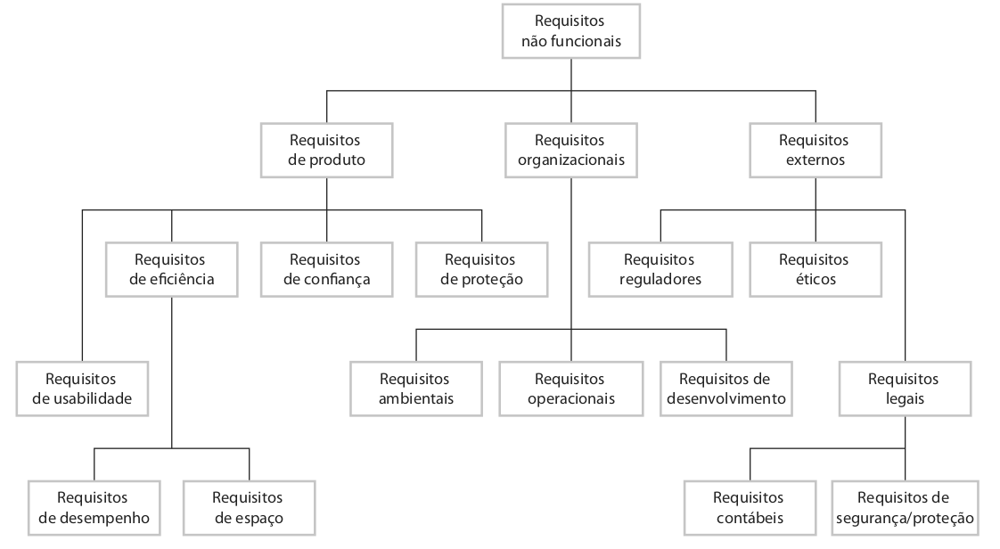

# LAB: Requisitos Funcionais e Não-Funcionais

Neste laboratório prático, vamos listar os requisitos funcionais e não-funcionais de um sistema de software.

Conforme aprenderemos nas últimas aulas, **requisitos funcionais** estão relacionados com o que um sistema deve fazer, isto é, as suas funcionalidades. Já os **requisitos não-funcionais** estão relacionados com as restrições do sistema.

Neste contexto, a engenharia de requisitos inclui quatro atividades principais: elicitação e análise, especificação, validação e gerenciamento. A **elicitação** envolve as tarefas para identificar e compreender os requisitos do sistema que pretendemos construir. Para descobrir os requisitos  do sistema podemos, por exemplo, realizar entrevistas, criar cenários de uso, casos de uso, e observar os usuários.

# Passo 1

Para relembrar os conceitos estudados, consulte o [resumo](https://alinebrito.github.io/eng-software/docs/engenharia-requisitos.html) sobre requisitos funcionais e não-funcionais discutidos na nossa última aula.

Como leitura complementar, você pode ler também a [Seção 3.1](https://engsoftmoderna.info/cap3.html#introdu%C3%A7%C3%A3o) do livro de Engenharia de Software Moderna.

# Passo 2

Suponha que você foi contratado para construir uma nova versão do [Sistema Integrado de Gestão de Atividades Acadêmicas (SIGAA)](https://sig.cefetmg.br/sigaa) do Cefet-MG, mostrado na figura a seguir. 

 

Nesta nova versão, as funcionalidades atuais devem ser mantidas. Você pode pensar também em novos recursos que poderiam ser adicionados na nova versão do sistema.

Neste passo, vamos listar os principais requisitos funcionais do SIGAA. Por exemplo:

> RF01: O sistema deve permitir que um professor cadastre um tópico de aula.

**Tarefa:** Complete a lista, adicionando pelo menos outros nove requisitos funcionais (RF01... RF10), sendo pelo menos dois deles referentes à novas funcionalidades que você gostaria de incorporar no sistema.

# Passo 3

Neste passo, vamos listar os requisitos não-funcionais do novo sistema. Os requisitos não-funcionais baseiam-se nas necessidades dos clientes. Eles podem ser organizados em três grandes grupos: 

* **Requisitos de produto**: Referem-se às restrições de comportamento do sistema, por exemplo, requisitos relacionados com velocidade, uso de memória, e usabilidade. 

* **Requisitos organizacionais**: Referem-se às políticas e restrições da organização, empresa, ou clientes. Por exemplo, requisitos relacionados com processos, ambiente operacional, etc.

* **Requisitos externos**: Referem-se aos requisitos derivados de fatores externos e processos, como por exemplo, requisitos relacionados com leis que o sistema deve respeitar.

A Figura abaixo mostra a organização dos requisitos não funcionais, conforme discutido por  Ian Sommerville no seu [livro](https://www.amazon.com.br/Engenharia-Software-Ian-Sommerville/dp/8543024978/):

 

O requisito abaixo é um exemplo de requisito não-funcional relacionado com a categoria "produto":

> RNF01: O sistema deve ter 99% de disponibilidade.

Normalmente, utilizamos métricas para especificar requisitos não funcionais. Dessa forma, evitamos requisitos vagos e genéricos. Por exemplo, em vez de *"o sistema deve ter alta disponibilidade"*, podemos utilizar *"o sistema deve ter 99% de disponibilidade"*, conforme mostrado no exemplo anterior.

Os requisitos não funcionais interagem com outros requisitos. Além disso, é difícil traduzi-los em requisitos mensuráveis. O custo para verificá-los pode ser elevado também.

**Tarefa:** Complete a lista, adicionando pelo menos outros dois requisitos não-funcionais do sistema (RNF01...RNF03).

# Passo 4

Submeter um relatório em formato PDF via SIGAA com o seu nome completo, matrícula, e resultado do laboratório prático.

Esta atividade deve ser realizada **individualmente**.

-------

**Referências**:

[Engenharia de Software Moderna](https://engsoftmoderna.info/cap3.html). Marco Tulio Valente. Capítulo 3 - Requisitos.

[Engenharia de Software](https://www.amazon.com.br/Engenharia-software-Ian-Sommerville/dp/8579361087). Ian Sommerville. 9ª edição. Capítulo 4 - Engenharia de Requisitos.

