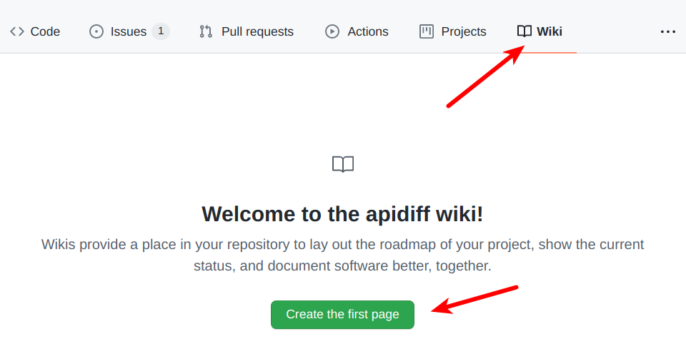
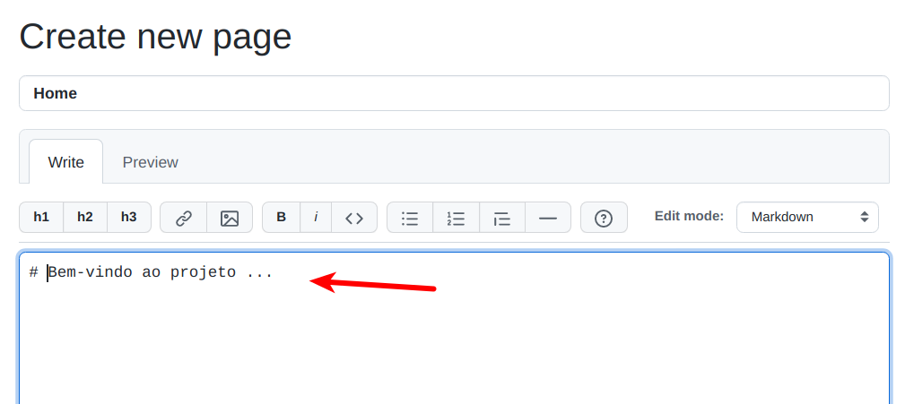
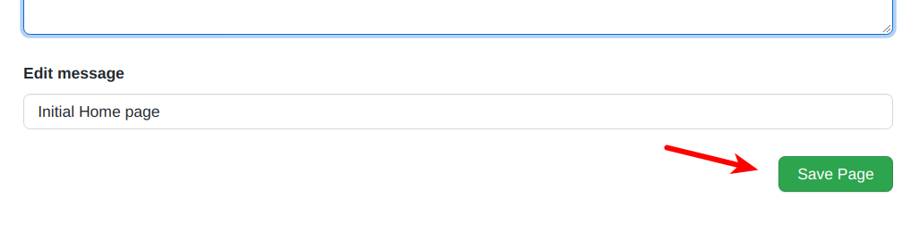

# LAB: Organizações GitHub & Wikis

Neste laboratório prático, vamos criar um wiki para o Projeto Integrado (PI) e uma organização.

A documentação de um projeto pode ser hospedada em [wikis](https://docs.github.com/pt/communities/documenting-your-project-with-wikis/about-wikis). Dessa forma, outras pessoas podem consultar a documentação para entender o sistema ou contribuir com o projeto.

Já uma [organização](https://docs.github.com/pt/organizations/collaborating-with-groups-in-organizations/about-organizations) é uma conta compartilhada, onde cada grupo pode organizar os projetos e trabalhar em equipe. 

 

# Passo 1:

No primeiro passo, vamos criar uma organização no GitHub. 

Escolha uma membro da sua equipe para criar a organização. Siga os [passos](https://docs.github.com/pt/organizations/collaborating-with-groups-in-organizations/creating-a-new-organization-from-scratch) disponíveis na documentação do GitHub para criá-la.

O nome da sua organização deve ser `cefetmg-2022-psi-gx`, onde `x` refere-se ao número do seu grupo. Consulte o número do seu grupo durante a aula. Por exemplo, se você pertence ao Grupo 1, o nome da organização é `cefetmg-2022-psi-g1`. 

__Importante:__ Cada grupo deve criar uma única organização.

 

# Passo 2:

Em seguida, adicione todos os integrantes do grupo na organização. Dessa forma, todos podem contribuir na construção do projeto. 

Para adicioná-los, utilize o botão `invete somewone` ou `convidar alguém` na página da organização.

 

# Passo 3:

Neste passo, vamos criar um projeto para hospedar a documentação do PI.

Primeiro, crie um repositório __público__  dentro da organização. O nome do projeto deve ser `wiki`. Para criar um novo projeto, utilize o botão `new`.

 

# Passo 4:

Após criar o GitHub do seu projeto, adicione um wiki:

* Acesse o menu ``Wiki`` e pressione o botão ``Create the first page``.

> 

 

* Complete as informações com o nome do seu projeto. Em seguida, pressione o botão ``Save Page``. Pronto, o wiki do seu projeto foi criado!

> 

 

> 

# Passo 4:

Escolha um integrante do grupo para informar o link da organização e do wiki na issue indicada durante a aula.

# Passo 5:

Nas próximas aulas, vamos adicionar a documentação do PI no wiki. Consulte a documentação oficial para a aprender a [criar](https://docs.github.com/pt/communities/documenting-your-project-with-wikis/adding-or-editing-wiki-pages) e [editar](https://docs.github.com/pt/communities/documenting-your-project-with-wikis/editing-wiki-content) páginas.

